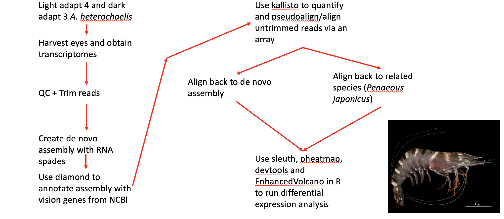

# Final project report  
# Title: Opsins and differentially expressed phototransduction genes in Alpheus heterochaelis  
  
This is my final report for my project on snapping shrimp eye transcriptomics!  
For this project I wanted to look at what opsin genes are expressed in snapping shrimp.
I also wanted to look at differential expression in genes related to phototransduction
between animals that were light and dark adapted. Currently there is no work done on what
opsin genes are found in snapping shrimp or how they regulate phototransduction genes when
light or dark adapted! Thus, my adventure began!  

# Project Outline 
My project had 10 steps:
  
# Samples  
Here are the samples I used and their treatment groups
1E - Light adapted A. heterochaelis
 
2E - Light adapted A. heterochaelis

3E - Light adapted A. heterochaelis
 
4E - Light adapted A. heterochaelis
 
5E - Dark adapted A. heterochaelis

6E - Dark adapted A. heterochaelis
 
7E - Dark adapted A. heterochaelis  

# Project steps:
1. Fast QC
- Light adapted:

 
[1E R1 QC FastQC HTML](/fastqc_results_project/1E_S11_R1_001_fastqc.html)

[1E R2 QC FastQC HTML](/fastqc_results_project/1E_S11_R2_001_fastqc.html)

[2E R1 QC FastQC HTML](/fastqc_results_project/2E_S13_R1_001_fastqc.html)

[2E R2 QC FastQC HTML](/fastqc_results_project/2E_S13_R2_001_fastqc.html)

[3E R1 QC FastQC HTML](/fastqc_results_project/3E_S15_R1_001_fastqc.html)

[3E R2 QC FastQC HTML](/fastqc_results_project/3E_S15_R2_001_fastqc.html)

[4E R1 QC FastQC HTML](/fastqc_results_project/4E_S17_R1_001_fastqc.html)

[4E R2 QC FastQC HTML](/fastqc_results_project/4E_S17_R2_001_fastqc.html)

- Dark adapted:

[5E R1 QC FastQC HTML](/fastqc_results_project/5E_S19_R1_001_fastqc.html)

[5E R2 QC FastQC HTML](/fastqc_results_project/5E_S19_R2_001_fastqc.html)

[6E R1 QC FastQC HTML](/fastqc_results_project/6E_S21_R1_001_fastqc.html)

[6E R2 QC FastQC HTML](/fastqc_results_project/6E_S21_R2_001_fastqc.html)

[7E R1 QC FastQC HTML](/fastqc_results_project/7E_S23_R1_001_fastqc.html)

[7E R2 QC FastQC HTML](/fastqc_results_project/7E_S23_R2_001_fastqc.html)

