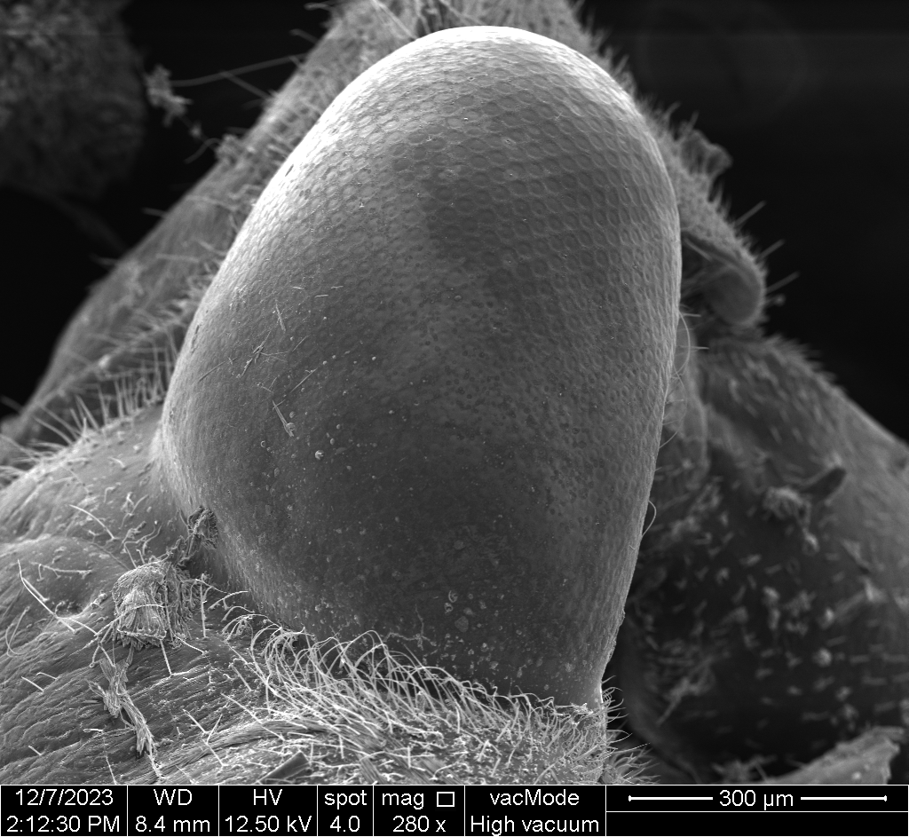

# BIOL7263 Genome Biology 
**This is a R Studio project for BIOL 7263 at the University of Tulsa**

This repository is set up for work by PhD Student, Tanner Mierow, at the University of Tulsa for the fall 2024 semester

[Learn about me on our lab's website!](https://www.kingston-lab.com/people.html)

# Enjoy some pictures from my research!

#  Assignments
Class 1 - August 29th
[test.sbatch](test.sbatch)
[test.sh](test.sh)

Class 2 - September 5th
Task 1
[ecoli_fast1c.sbatch](ecoli_fastqc.sbatch)
[ecoli_fastqc.sh](ecoli_fastqc.sh)
[read 1 html](read_1_fastqc.html)
[read 2 html](read_2_fastqc.html)

Class 3 - September 12th
[Proposal](proposal.pdf)
[Task 2 sbatch](ecoli_trim.sbatch)
[Task 2 sh](ecoli_trim.sh)
[Task 5 sbatch](ecoli_index.sbatch)
[Task 5 sh](ecoli_index.sh)